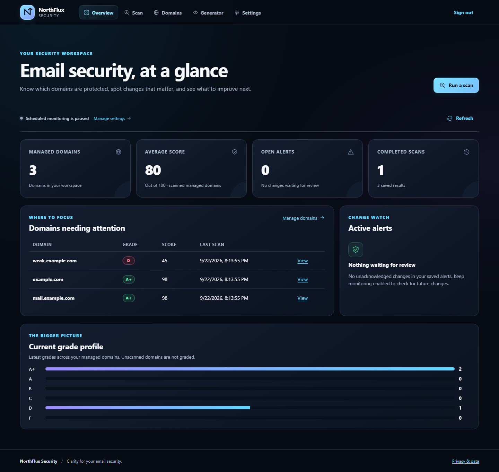

# NorthFlux Security

Understand your domain's email defences. Find the gaps. Make informed changes.

[](https://github.com/L-chapman/AuroraEdge-FYP/actions/workflows/ci.yml)

NorthFlux Security is a self-hosted email security workspace. It checks the public settings that help prevent people impersonating your domain, turns the findings into understandable scores and recommendations, and keeps a history so you can see what changed.

You run it on your own computer or server. The interface is built with **React and TypeScript**, with a Python service handling checks, reports and optional DNS changes.



*The screenshot uses fictional test results for example domains, not customer data or a live security assessment.*

## What you can do

| Start with a question | NorthFlux helps you answer it |
|---|---|
| Could someone impersonate our email domain? | Check who is allowed to send email, how messages are signed, and how receivers should handle suspicious messages. |
| What needs attention first? | See a score, grade, individual findings and suggested next steps. A score is a guide, not a security guarantee. |
| Has anything changed? | Save domains, compare scan history, and optionally enable scheduled checks and change alerts. |
| How do I share the findings? | Generate PDF, CSV and Markdown reports. |
| What should the records look like? | Build draft DNS records using your mail provider and settings. Review them before publishing. |
| Can I apply a fix? | Use the optional Cloudflare connection for supported changes to a zone you are authorised to manage. |

Checks include SPF, DKIM and DMARC (email identity); MTA-STS, TLS-RPT and STARTTLS (delivery protection); mail routing, BIMI and blocklist signals. [The project tour](docs/PROJECT_TOUR.md) explains how the pieces fit together without requiring a security background.

If a lookup fails or important records are ambiguous, the result is **Incomplete**, not a confident grade. The interface explains what could not be checked, keeps that warning in history and reports, and blocks automatic fixes until a usable scan is available. Finding a record alone does not prove that every policy setting is safe.

**You stay in control:** scanning does not change DNS. Scheduled monitoring and automatic fixes are separate, disabled-by-default choices. Cloudflare is optional.

## Try it on your computer

You need Git, Python **3.10 or newer**, and Node.js **22.12 or newer** with npm. The first launch needs internet access to install dependencies. Use a writable local folder, such as Documents, rather than running inside a ZIP or a read-only drive.

```text
git clone https://github.com/L-chapman/AuroraEdge-FYP.git NorthFlux-Security
cd NorthFlux-Security
```

Then choose your system:

**Windows — PowerShell**

```powershell
.\START.bat
```

You can also double-click `START.bat` in the project folder.

**Linux — terminal**

```sh
sh ./start.sh
```

Both launchers prepare a private Python environment, install the locked web dependencies, build the React interface and start NorthFlux at **http://127.0.0.1:8080**. Keep the terminal open; press **Ctrl+C** to stop. Your saved results remain in the project folder.

Setup also checks for missing or changed installed dependencies before reusing an existing environment. If it cannot prepare a consistent installation, it stops with an error instead of starting a partly broken service.

For a different port, or a server without a desktop:

```text
python start.py --no-browser --port 8081
```

On Linux, use `python3` if `python` is not available. `python start.py --setup-only` prepares the project without starting the server.

This is a **local evaluation setup**, not a public deployment. It is only reachable from the same computer and does not require a sign-in unless you set `DASH_TOKEN`. Do not use it on an untrusted shared computer. Local launchers do not read `.env` files; see the [setup and troubleshooting guide](docs/DEPLOYMENT.md) for configuration, missing prerequisites and production deployment.

## Running it for an organisation

Use the supplied Docker deployment with HTTPS, a strong access token, restricted access and backups. The image builds the web interface automatically and runs as a non-administrator with a read-only system filesystem.

[Follow the production deployment guide →](docs/DEPLOYMENT.md)

The supported design is **one operator, one application process and one local SQLite database**, with a shared access token rather than individual accounts and roles. This is not a hosted service with separate customer accounts, company-wide sign-in or multiple redundant servers. Those would require additional engineering.

Live checks need public DNS, HTTPS and sometimes outgoing SMTP access; some networks block SMTP. Scan connections refuse private or special-purpose addresses, use time and response-size limits, and do not follow MTA-STS HTTPS redirects or inherit a machine's HTTP proxy settings. Internal-only mail systems are outside this scanning scope.

## For reviewers: where the engineering is

NorthFlux is more than a static dashboard. It joins a network scanner, explainable scoring, a persistent history, reporting, scheduling and a guarded change workflow behind one interface.

- **Clear separation:** React handles the interface; the Python service performs checks and controls all data changes.
- **Safer operations:** authenticated sessions, checks against forged browser requests, zone-ownership checks and a record of DNS changes.
- **Honest results:** incomplete checks remain ungraded; failed prerequisite reads stop DNS changes rather than being treated as missing records.
- **Reliable state:** scan results are saved together, and a scan finishing late cannot restore data that the operator has just deleted.
- **Usable workflows:** responsive navigation, keyboard controls, understandable failures and reduced-motion support.
- **Repeatable delivery:** locked frontend dependencies, declared Python requirements, automated browser journeys, Windows/Linux checks and a source package that excludes secrets and local data.

Read the [guided project tour](docs/PROJECT_TOUR.md), [architecture](docs/ARCHITECTURE.md), or [test guide](docs/TESTING.md) for the implementation and its limits. The tour points to the relevant source files so claims can be inspected rather than taken on trust.

## What is tested?

The [GitHub Actions history](https://github.com/L-chapman/AuroraEdge-FYP/actions/workflows/ci.yml) records results against exact revisions. Check the badge above for the current default branch. The [deep-debug review](docs/DEEP_DEBUG_REVIEW.md) records the release's findings, fixes, completed checks and remaining limits.

| Area | Automated checks |
|---|---|
| Windows and Linux | Python tests on both systems with Python 3.10 and 3.12; fresh-folder launcher checks with Python 3.12 and Node 22.12/24. |
| React interface | Type checks, lint checks, unit/component tests and a production build. |
| Browser journeys | Chromium on Windows; Chromium, Firefox, WebKit and a mobile Chrome profile on Linux. Includes scan, domain, settings, generator and sign-in flows. |
| Accessibility | Automated checks, narrow-screen layouts, keyboard navigation and reduced motion. These are not a substitute for a complete accessibility audit. |
| Security and packaging | Dependency audits, secret scanning, security regression tests, a hardened-container smoke test and source-archive checks. |

Tests use controlled results for repeatability. The deep-debug release does not claim a tested live Cloudflare write or a deployed production server. A connection check only reads Cloudflare data; it does not prove permission to change DNS. macOS, ARM devices and every possible OS/browser combination are **not yet validated**. See [Testing](docs/TESTING.md) for the measured results, exact commands and known limitations. No test suite can promise zero bugs on every computer.

## Find your way around

```text
frontend/       React interface, component tests and browser journeys
src/app/        Scanning, scoring, API, storage, reports and integrations
tests/          Python behaviour and security tests
docs/           Current product guides
docs/academic/  Clearly separated original research and development history
scripts/        Test, demonstration and release tools
start.py        Shared Windows/Linux local launcher
```

Generated reports, saved scan data, logs, installed dependencies and build output stay local and are not included in GitHub or the source release. Do not add access tokens or customer data to issues or commits.

## Background, scope and contributing

Created by **Leon Chapman**, NorthFlux began as the independent home project **AuroraEdge** and later became a Belfast Metropolitan College final-year project. The GitHub address keeps the original name so existing links continue to work. The [academic archive](docs/academic/README.md) preserves that history; current product instructions are in the [documentation index](docs/INDEX.md).

This is an independently developed, single-operator project—not a claim of commercial adoption or a security certification. Only assess systems you are authorised to test, and review proposed DNS changes before applying them.

Feedback and contributions are welcome: see [Contributing](CONTRIBUTING.md). Report vulnerabilities privately through the [security policy](SECURITY.md). See [Privacy](docs/PRIVACY.md) for what the application stores.

The source is publicly viewable. No open-source licence has been selected; the repository does not currently grant a general licence to reuse or distribute the code.
