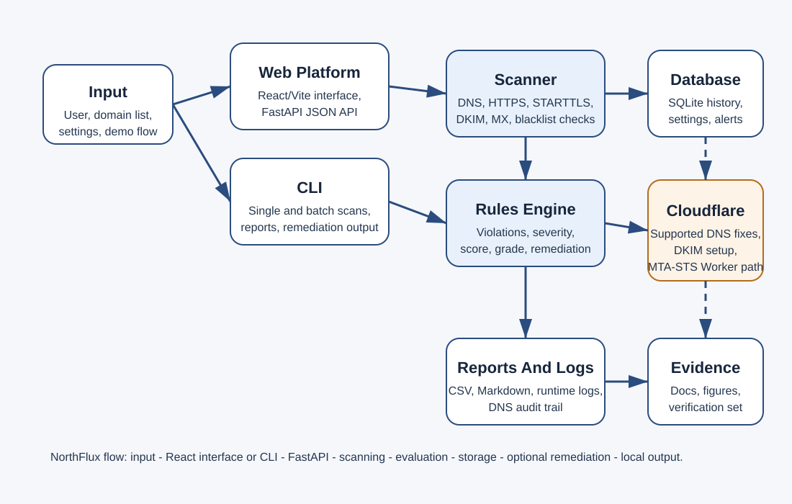

# AuroraEdge Architecture

This document gives the final design view of AuroraEdge.

Use it when you want the system layout, the module split, and the main design decisions in one place.

---

## System Diagram

---

## Main Flow

1. A user starts from either the dashboard or the CLI.
2. The scanner collects public DNS, HTTPS, and optional STARTTLS data.
3. The rules engine turns the raw scan into violations, severity, score, grade, and guidance.
4. Results are saved in SQLite and can also be written to CSV and Markdown reports.
5. If Cloudflare credentials are configured and the domain belongs to the right zone, the remediation layer can apply supported fixes.
6. Logs and audit records capture what happened for later review.

---

## Module Split

### `src/app/scanner.py`

Handles DNS lookups, MTA-STS checks, TLS-RPT checks, DKIM selector probing, blacklist checks, and optional STARTTLS grading.

### `src/app/rules.py`

Applies the RFC-based checks to scan results. This is where AuroraEdge turns protocol data into a score, severity, grade, violations, and remediation examples.

### `src/app/dashboard.py`

Hosts the FastAPI dashboard and API routes. It covers the main pages, live scan flow, managed domains, settings, alerts, downloads, and the test hub.

### `src/app/cli.py`

Provides the command-line path for single-domain scans, file-based batch scans, remediation output, and optional Cloudflare fixing.

### `src/app/database.py`

Stores scan history, settings, alerts, and managed-domain state in SQLite. This keeps the project self-contained and easy to run on a marker's machine.

### `src/app/dns_fix.py`

Wraps the Cloudflare API for the supported remediation path. That includes SPF, DMARC, TLS-RPT, MTA-STS DNS, the MTA-STS Worker path, and DKIM for supported providers that can be identified safely.

### `src/app/logging_config.py`

Keeps the logging format and file handlers in one place so the scanner, dashboard, and audit trail all behave consistently.

### `src/app/analysis.py`

Generates the statistics and charts used in the academic analysis material.

---

## Why The Modules Are Separated

- The scanner changes for protocol handling, not for UI concerns.
- The rules engine changes for scoring logic, not for network collection.
- The dashboard and CLI both reuse the same scanner and rules code, which keeps the results consistent across interfaces.
- Database code stays separate so persistence changes do not leak into the scan or UI paths.
- Cloudflare code stays isolated because it has the highest operational risk and the strongest permission checks.

This split made it easier to test the system in layers and keep the code readable during the project.

---

## Why Remediation Is Opt-In

AuroraEdge does not assume it is allowed to change DNS.

Remediation only works when:

- Cloudflare credentials are supplied
- the target domain belongs to the configured zone
- the requested fix is inside the supported scope

This keeps the project aligned with the ethical limits in `docs/PRIVACY_AND_ETHICS.md` and avoids changing third-party infrastructure by mistake.

---

## Why SQLite Was Chosen

SQLite was used because it fits the project goals well:

- no server install is needed
- it runs locally on a lecturer or marker's machine
- it is easy to ship with the project
- it is enough for the scan history, settings, and alerts volume used here

WAL mode is enabled so the app handles repeated writes more safely during scanning and monitoring.

---

## Why FastAPI, Python, Cloudflare, And GitHub Were Chosen

### FastAPI

FastAPI gave a quick way to build the dashboard, JSON endpoints, and test hub in one Python stack. It also made route testing straightforward.

### Python

Python suited the project because the DNS, HTTP, SMTP, reporting, and test tooling are all easy to work with in one language.

### Cloudflare

Cloudflare was chosen for the remediation path because it has a clear API, common real-world adoption, and support for both DNS edits and Worker-based MTA-STS hosting.

### GitHub

GitHub was used for version control, backup, and easy sharing of the final code with markers. It also gives a clean public or private history of the final submission state.

---

## Design Boundaries

- AuroraEdge checks public records and public-facing transport settings only.
- It does not log into mailboxes or mail servers.
- DNS fixing is limited to the supported Cloudflare workflow.
- DKIM auto-fix is provider-aware, not universal.
- BIMI is reported, but not auto-fixed.
- Local HTTP is fine for testing, but production use should sit behind TLS.

These boundaries are deliberate. They keep the project practical without pretending to solve areas it does not control.